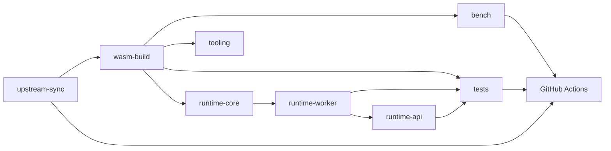

# Architecture

## Boundary notes

- `upstream-sync` owns upstream tracking, overlays, and ABI validation (`abi/contract.json`).
- `wasm-build` produces manifests every downstream consumer reads; do not hand-edit `wasm-build/dist/` outputs.
- `runtime-core` is the only package that calls Emscripten exports; helpers live under `runtime-core/src/emscripten/`.
- `runtime-worker` talks to `runtime-core` over a versioned protocol, not to WASM internals.
- `runtime-api` talks to the worker protocol only (no direct WASM).
- `bench` exercises real artifacts and records environment metadata for comparable runs.
