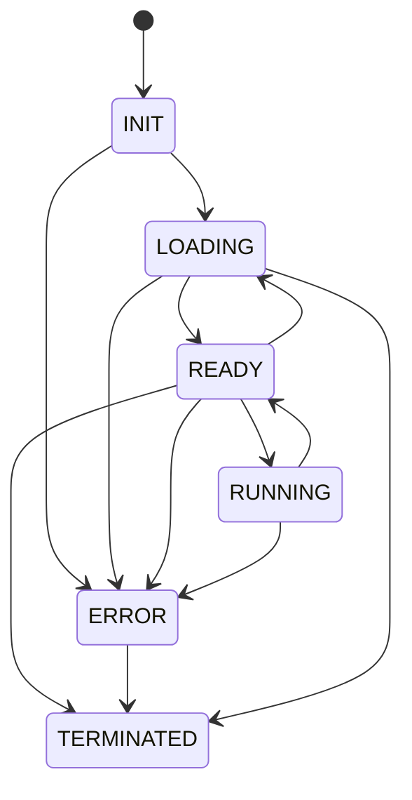

# Worker State Machine

## Notes
- `INIT` means the worker is alive but no model is loaded.
- `LOADING` covers initial model ingestion and explicit model replacement.
- `ERROR` is terminal for serving requests; callers should destroy and recreate workers.
